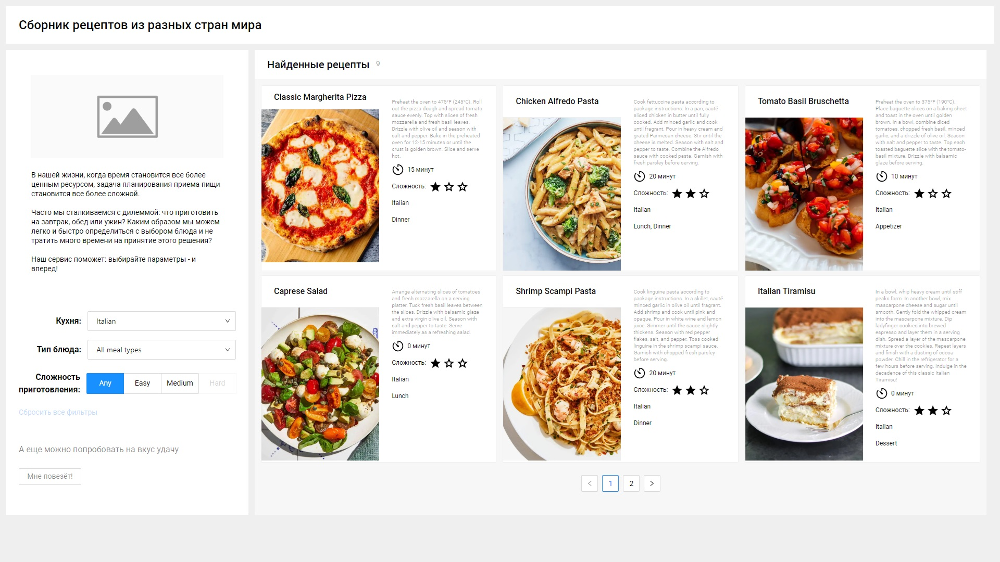

# «Recipes»

### Описание: React-приложение с рецептами

#### Для запуска на localhost использовать команду:

```
yarn start
```

### Использованные технологии и инструменты:

- React
- React Router
- SASS
- Typescript
- Babel
- Webpack

<!--   -->

